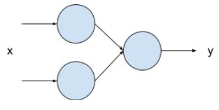

# TinyML

This course is part of the Verizon Skill Forward program. Thank you to Verizon for providing the full course experience for self-learners like me.

## Introduction
* TinyML is concerned with creating intelligent systems on microcontrollers.
* Microcontrollers are cheap, energy efficient, and resource contrained devices.
* Big Picture: Generate predictions from data generated by external sensors (i.e. cameras, pressure, temperature, etc.).

### Hardware and Software Challenges
Hardware | Software 
-|-
Limited in terms of performance, power consumption, and storage | Not as portable as mainstream software

### Floating Point Numbers on Embedded Systems
Before, floating point operations were handled via software libraries, but they were slow. Now, with Floating Point Units (FPUs), which are dedicated hardware processors to perform operations on floating point numbers, operating on floating point numbers are much faster. However, if you write code optimized for a specific FPU, it may not work on other FPUs, as they may have different architectures or instruction sets.

### Embedded Machine Learning Software Challenges
Larger models require more computational power but an embedded systems can only offer so much it. So, we need to find a way to fit these large models into our microcontrollers while keeping the restrictions in mind. Here are some ways of doing so:
* Model Compression: Pruning - Removing some nodes and connections while still producing the same results.
* Model Compression: Quantization - Reducing the size of the numbers we're working with to take up less memory space.
* Model Compression: Knowledge Distillation - Only keep the most critical pieces of information to produce our results.
* Reducing Runtimes: Making inferences from our pre-made model instead of learning from new data

## Linear Regression
Using linear regression we use labeled data to train models that learn patterns or rules. These models are then used to make predictions when presented with new, unseen data.

To evaluate how well our model is performing, we calculate the Mean Squared Error (MSE). This involves taking the average of the squared differences between the model's predicted values (Y) and the actual values (Y'). A lower MSE indicates that our model's predictions are closer to the real data, meaning the model is performing better. Check out this [example](mse.ipynb).

Now, imagine you have a graph called $L$ where the y-axis represents the error (MSE's output in this case), and the x-axis represents one of the parameters in your model (like a weight). If your model has multiple parameters, you'd have more axes, but visualizing it becomes tough.

Your goal is to find the minimum/lowest point on $L$. This point represents the best parameter value that minimizes the error. The method for doing so is called gradient descent. We iteratively update every weight and bias in our model by starting with an initial weight $\theta_t$ and a learning rate $\alpha$ with the following formula:

$$
\theta_{t+1} = \theta_t - \alpha \nabla L(\theta_t)
$$

From calculus, we know that to get the minimum point on $L$, we take it's first derivative $\nabla L(\theta_t)$, set it to 0, find the $\theta_t$ that make it 0, and check if they're minimums. Luckily, $L$ is shaped like a parabola, so finding the minimum is pretty straightforward.

Since $\nabla L(\theta_t)$ represents how **fast** the error is changing at $\theta_t$. This information helps us adjust the current $\theta_t$ to improve the model. 

- **If $\nabla L(\theta_t)$ is positive:** This means that the loss function is increasing. If you drew a vertical line to symmetrically cut the parabola in half, we'd be on the right side of the line. So, we should reduce $\theta_t$ to get closer to the minimum. This is done by subtracting $\alpha \nabla L(\theta_t)$ from $\theta_t$.

- **If $\nabla L(\theta_t)$ is negative:** This means the loss function is decreasing. If you drew a vertical line to symmetrically cut the parabola in half, we'd be on the left side of the line. So, we increase $\theta_t$ to get closer to the minimum. Since $\nabla L(\theta_t)$ is negative, subtracting a negative value (which is equivalent to adding a positive value) increases $\theta_t$.

Check out a [code sample](gradient-descent.ipynb).

## Neural Networks
As data becomes more complex, simple mathematical models like linear regression may not be sufficient to capture intricate patterns. In such cases, more sophisticated models like neural networks can be used.

A neural network is composed of units called neurons. Each neuron takes a set of inputs, processes them, and generates a single output. This output can then be passed on as an input to other neurons in a neural network.

When you train a neural network, you adjust the parameters of each indivudal neurons (often called weights and biases) so that the network's output approximates the desired outcome.

Here is an [example](neural-network.ipynb) of a single neuron performing linear regression.

## Multi-layer Neural Network
If you have multiple layers like this:

Now your neural network takes in two inputs and spits out a single output. An important thing to note is that if a neuron takes in two or more inputs, it has to be trained on the equal number of weights. There is always one bias, that doesen't change. Here is an example of a [example](multi-layer-neural-network.ipynb) of a multi-layer neural network performing linear regression.

## Classification
In classification, we basically predict categories instead of values like we did in linear regression. We saw that we could use a neural network to perform linear regression. But, we could also use it to perform classification. In this case, our neural network will have several outputs. 

Say we are trying to classify if a hand-written digits 0 through 9. Then our neural network would have 10 outputs, each of which correspond to the numbers 0 through 9 respectively. Then classifying a say a 5 would give an output of probabilities that might looks like this [0.001 0.00001 0.00004 0.0001 0.003 0.9998 0.0001 0.00009 0.00004 0.00001]. Our inputs would be the number of pixels in your canvas (or image). Here is an [example](dnn.ipynb).

## Splitting Datasets
Normally, you'll run into things like training data, validation data, and test data: 
* Training data is used to train your neural network (finding the appropriate weights and biases).
* Validation data is used to measure how well your neural network has been trained after each epoch (step) with unseen data. This is crucial to ensure your neural network does not over specialize on your training data. And, ideally, you want your training accuracy to be as close to your validation accuracy. The lower your validation accuracy, it probably means that your network is over specializing on your training set. 
  * NOTE: It is not used to find the appropriate weights and biases for your neural network. It's just something to check whether your network is on the right path or not.
* Test data is the clean set to just test your network.

## Convolutional Neural Networks (CNNs)
Commonly used in computer vision applications, CNNs are basically neural networks that have convolutional layers that performs convolutions before going into your dense layers. Convolutions are basically an operation where we scan every pixel and multiply each pixel by weights in our filter. After a convolution is applied, we get this thing called a feature map. 

CNNs combined with pooling, which aims to compress the image but keep the important features, it makes working with images more efficient. One type of pooling called MAX pooling involves looking at it's neighbors and taking the maximum value. Check out this [example](./convolutions.ipynb).

## AI Infrastructure
* Data Engineering: 
  * Fulfilling data requirements
  * Collecting and labelling data
  * Inspecting and cleaning the data
  * Preparing data for training
  * Augment the data: Transforming existing data for new data 
* Model Engineering:
  * Training ML models
  * Improving training speed
  * Setting target metrics
  * Evaluate the model against the metrics
  * Optimize the model to meet target metrics
* Model Deployment:
  * Putting the model onto a device
  * Optimize performance and energy
  * Engineering security and privacy
  * Improving inferences and fine-tuning the model
* Product Analytics:
  * Dashboards to evalutate how the device does with field data
  * Find areas for improvements

## TinyML Workflow
This is basically everything above but represented concisely.
1. Collect data
2. Preprocess data
3. Design a model
4. Train a model
5. Evaluate and optimize the model
6. Convert the model for a microcontroller
7. Deploy model
8. Make inferences

## Developing Models for Microcontrollers
After building and training a model then we use tools provided by TensorFlow to convert the model to a sutiable format that can be ran on a microcontroller. Conversion involves pruning and quantization. Here is an [example](./tflite-convert.ipynb) on how that works.
